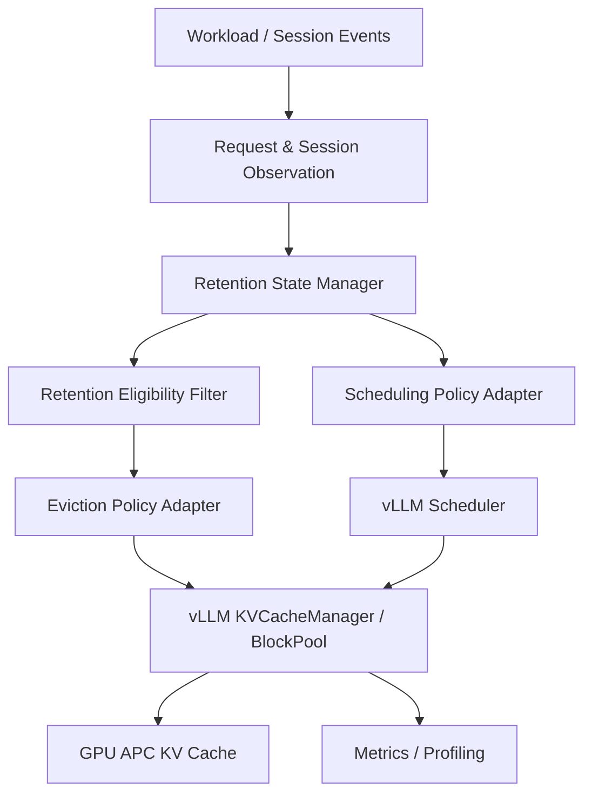

# KV Cache Management Optimization for LLM Inference

## Goal

This course project studies **cost-aware KV-cache management for LLM serving** on a real vLLM backend.

The current research scope includes three interacting decisions:

- **retention / protection** — how long reusable KV state should remain protected;
- **eviction / victim selection** — which cached blocks should be reclaimed under memory pressure;
- **scheduling coordination** — whether request/program admission order should use cache state to reduce expensive recomputation.

The project compares native vLLM behavior, a Continuum-style retention+scheduling baseline, and a proposed cost-aware design.

## Current Status

```text
Phase 0   Backend & architecture validation          CLOSED
Phase 1A  Common block-level eviction adapter        CLOSED
Phase 1B  Continuum → vLLM feasibility mapping       CLOSED
Phase 1B  Continuum implementation scope             FROZEN
Phase 1B  Continuum baseline implementation          NEXT
```

The real backend is frozen to **vLLM 0.27.1** with GPU Automatic Prefix Caching (APC).

## Current Architecture



The validated Phase 1A eviction path is:

```text
vLLM cached free blocks
    -> VLLMEvictionBridge
    -> EvictionPolicyAdapter
    -> selected block IDs
    -> native BlockPool allocation / eviction bookkeeping
```

Phase 1B extends this lower-level path with session identity, dynamic TTL retention, soft protection, and a narrow scheduler adapter. Native vLLM queue/ref-count/hash bookkeeping remains authoritative.

## Baselines

### Baseline 1 — vLLM native system

- vLLM 0.27.1
- GPU APC
- native block-level LRU behavior
- native scheduler

### Baseline 2 — Continuum-style adapted system

Frozen Phase 1B scope:

- explicit `program_id/session_id` from workload/orchestrator;
- online tool-gap / reuse history;
- dynamic TTL estimation;
- soft retention protection without modifying native `ref_cnt` semantics;
- lazy TTL expiry and deterministic pressure release;
- narrow program-level admission-order scheduling adapter;
- existing Phase 1A eviction adapter and native BlockPool cleanup retained.

This is an adaptation to vLLM 0.27.1, not an exact source-level reproduction of Continuum.

## Proposed Method

The proposed method will investigate **cost-aware coordination** across retention, eviction, and scheduling. The exact cost model and scheduling rule are not yet frozen.

The intended distinction is to reason explicitly about the runtime consequence of losing KV state, rather than relying only on recency or a predicted retention horizon.

## Repository Modules

- `runtime/vllm`: real vLLM integration, adapters, observers, and bridges.
- `scheduler`: project scheduling abstractions and future scheduling-policy integration.
- `kv_cache`: simulator/cache-policy contracts used for deterministic testing.
- `policies`: baseline and proposed policy implementations.
- `workload`: datasets, traces, controlled multi-turn workloads, and session events.
- `metrics`: runtime events, evaluation metrics, and profiling support.
- `benchmarks`, `configs`, `docs`, `tests`: experiment, reproducibility, and project documentation.

The deterministic simulator remains useful for unit/interface testing only and must not be used for real serving-performance claims.

## Key Documents

- [`docs/experiment-plan.md`](docs/experiment-plan.md) — authoritative research questions, experiment structure, and scope.
- [`docs/baseline-freeze.md`](docs/baseline-freeze.md) — frozen Phase 1B Continuum adaptation scope.
- [`docs/continuum-vllm-mapping.md`](docs/continuum-vllm-mapping.md) — feasibility mapping from Continuum mechanisms to vLLM 0.27.1.
- [`docs/policy-adapter-design.md`](docs/policy-adapter-design.md) — validated Phase 1A block-level eviction adapter.
- [`docs/team-responsibilities.md`](docs/team-responsibilities.md) — ownership and phase responsibilities.

## Team Responsibilities

Member 1 — Architecture, scheduler/cache interfaces, integration, project management  
Member 2 — Background, related work, motivation  
Member 3 — Baseline system implementation and validation  
Member 4 — Cost-aware optimization design and implementation  
Member 5 — Dataset, workload and benchmark framework  
Member 6 — Evaluation, visualization, profiling and analysis  
Member 7 — Slides and presentation

## Development Rules

- Do not develop directly on `main`; use task branches and PRs.
- Preserve the common vLLM backend path across policies wherever practical.
- Do not silently change a frozen baseline mechanism to simplify implementation.
- Separate component-level attribution experiments from full-system comparisons.
- Do not commit model weights, Hugging Face caches, Docker data, or large raw traces.

## Development Status Note

`DummyEvictionPolicy` and the deterministic simulator are **not baselines** and **not the proposed method**. They exist only for deterministic functional/interface testing.
