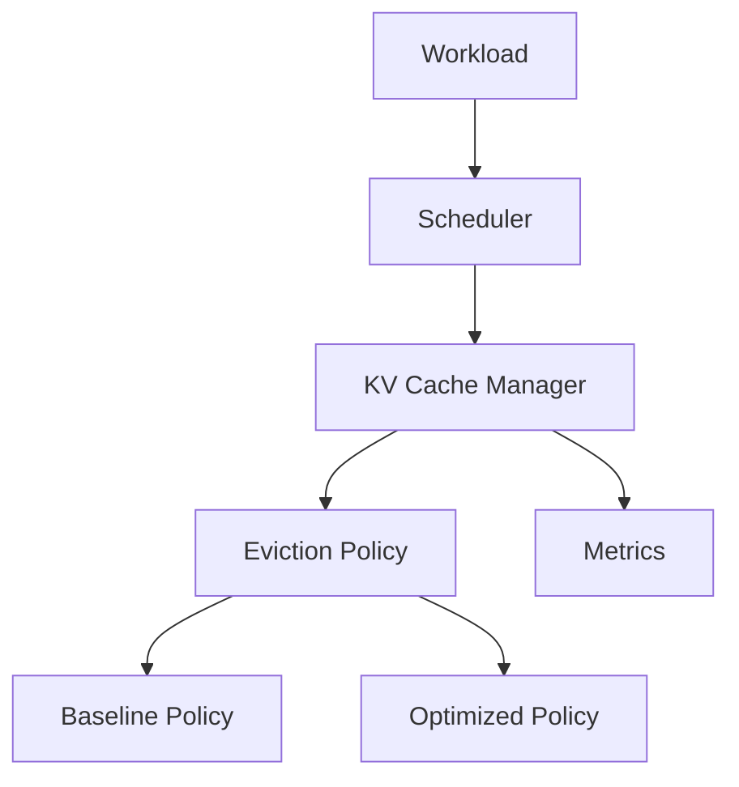

# KV Cache Management Optimization for LLM Inference

## Goal

This course project will reproduce KV-cache management baselines and investigate a new KV-cache optimization policy for LLM inference.

## Current Status

**Phase 0 — Backend & Architecture Validation: COMPLETE.**

The project has validated a real GPU backend using **vLLM 0.27.1** with Automatic Prefix Caching (APC): real inference, direct prefix-cache hits, controlled cache pressure, and cached-block eviction have all been observed. The validated real eviction path is:

```text
BlockPool.get_new_blocks()
→ FreeKVCacheBlockQueue.popleft_n()
→ BlockPool._maybe_evict_cached_block()
```

The project is now entering **Phase 1 — Baseline Reproduction**. Phase 0 is infrastructure/architecture validation and must not be described as reproduction of the strong baseline.

See [`docs/vllm-smoke-test.md`](docs/vllm-smoke-test.md) for the Phase 0 evidence and [`docs/backend-selection.md`](docs/backend-selection.md) for the pinned backend decision.

## Architecture



The local simulator remains useful for deterministic interface and policy tests, but formal serving-performance claims must use the real vLLM backend.

## Modules

- `scheduler`: request lifecycle and execution selection.
- `kv_cache`: logical block allocation and immutable policy state.
- `policies`: pluggable eviction implementations.
- `workload`: dataset-agnostic request sources.
- `metrics`: runtime events for evaluation extensions.
- `runtime`: deterministic functional simulator only.
- `benchmarks`, `configs`, `docs`, `tests`: experiment support and project documentation.

## Setup

```bash
python -m venv .venv
pip install -e ".[dev]"
pytest
python scripts/run_demo.py
```

The real vLLM backend is run separately in the pinned Docker environment; it is not installed into the host Python environment by the simulator setup above.

## Team Responsibilities

Member 1 — Architecture, scheduler, integration, project management  
Member 2 — Background, related work, motivation  
Member 3 — Baseline KV cache policy  
Member 4 — Optimization design and implementation  
Member 5 — Dataset, workload and benchmark framework  
Member 6 — Evaluation, visualization, profiling and analysis  
Member 7 — Slides and presentation

See [`docs/team-responsibilities.md`](docs/team-responsibilities.md) for detailed ownership, deliverables, boundaries, Q&A responsibilities, and phase-by-phase collaboration.

## Development Status

`DummyEvictionPolicy` is **not** a baseline and **not** the proposed method. It exists only for simulator smoke testing.

The next implementation milestone is the common real-backend policy integration path followed by baseline reproduction; the proposed cost-aware policy should not be implemented before the baseline path is stable.
