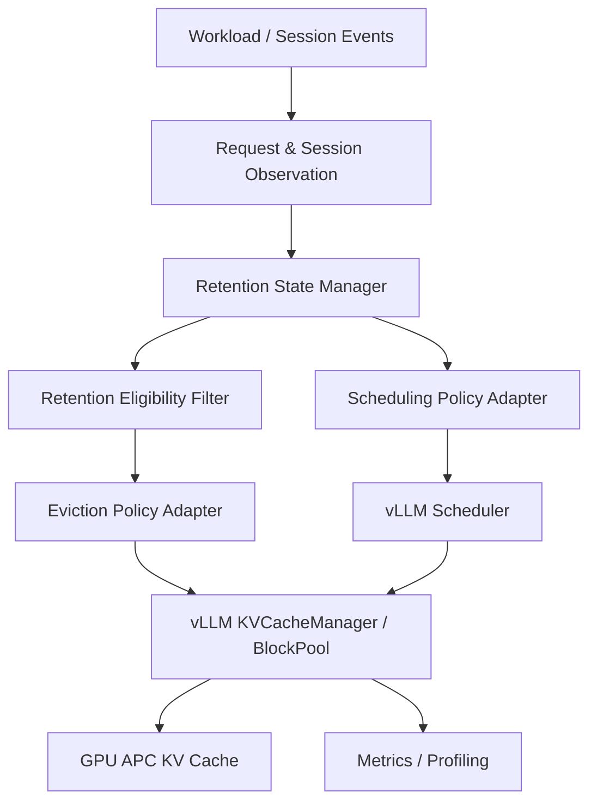

# KV Cache Management Optimization for LLM Inference

## Goal

This course project studies **cost-aware KV-cache eviction for LLM serving** on a real vLLM backend.

The broader system context includes retention/protection and scheduling coordination, but the research contribution remains centered on one primary decision:

> **When GPU KV-cache capacity is insufficient, which cached blocks/prefixes should be evicted to minimize future recomputation cost?**

The project therefore uses the following hierarchy:

```text
Primary research core
    Cost-Aware Eviction / Victim Selection

Supporting cache mechanism
    Retention / Protection

System coordination
    Scheduling
```

Retention and scheduling are included where needed to reproduce strong system baselines and to evaluate later coordination extensions. They do not replace eviction as the main research problem.

## Current Status

```text
Phase 0   Backend & architecture validation          CLOSED
Phase 1A  Common block-level eviction adapter        CLOSED
Phase 1B  Continuum → vLLM feasibility mapping       CLOSED
Phase 1B  Continuum implementation scope             FROZEN
Phase 1B  Continuum baseline implementation          NEXT
```

The real backend is frozen to **vLLM 0.27.1** with GPU Automatic Prefix Caching (APC).

## Research Structure

### Core contribution path

```text
vLLM native APC LRU
        vs.
Cost-Aware Eviction
```

This comparison is the primary algorithmic contribution and must remain independently evaluable with native scheduling fixed.

### Supporting / system-level path

```text
Eviction
  + Retention
  + Scheduling coordination
```

These layers are used for:

- reproducing Continuum-style system behavior;
- testing whether retention further strengthens eviction decisions;
- testing whether scheduling coordination further improves end-to-end performance.

## Current Architecture



The **Eviction Policy Adapter is the primary research decision boundary**. Retention and scheduling provide context or coordination around it.

The validated Phase 1A eviction path is:

```text
vLLM cached free blocks
    -> VLLMEvictionBridge
    -> EvictionPolicyAdapter
    -> selected block IDs
    -> native BlockPool allocation / eviction bookkeeping
```

## Baselines

### Baseline 1 — vLLM native system

- vLLM 0.27.1
- GPU APC
- native block-level LRU behavior
- native scheduler

### Baseline 2 — Continuum-style adapted system

Continuum is reproduced as a strong **system-level baseline**, including the retention and scheduling mechanisms required by the frozen Phase 1B scope:

- explicit `program_id/session_id`;
- online tool-gap / reuse history;
- dynamic TTL estimation;
- soft retention protection;
- lazy expiry and deterministic pressure release;
- narrow program-level admission-order scheduling adaptation;
- existing Phase 1A eviction path and native BlockPool cleanup.

This does **not** mean the proposed method becomes scheduler-centric. Continuum's full-system mechanisms are reproduced because they are intrinsic to that baseline.

## Proposed Method

The proposed method starts from **Cost-Aware Eviction / Victim Selection**.

Conceptually:

```text
EvictionLoss = f(
    recomputation_cost,
    reuse_signal,
    memory_footprint,
    cache_pressure
)
```

The exact function is not yet frozen.

After the eviction-only method is validated, optional extensions may add:

```text
Ours-Evict
Ours-Evict+Retention
Ours-Full = Eviction + Retention + Scheduling
```

`Ours-Evict` must remain an independently meaningful method and experiment.

## Key Documents

- [`docs/experiment-plan.md`](docs/experiment-plan.md) — research questions and experimental hierarchy.
- [`docs/baseline-freeze.md`](docs/baseline-freeze.md) — frozen Phase 1B Continuum adaptation scope.
- [`docs/continuum-vllm-mapping.md`](docs/continuum-vllm-mapping.md) — feasibility mapping from Continuum to vLLM 0.27.1.
- [`docs/policy-adapter-design.md`](docs/policy-adapter-design.md) — validated Phase 1A block-level eviction adapter.
- [`docs/team-responsibilities.md`](docs/team-responsibilities.md) — ownership and phase responsibilities.

## Team Responsibilities

Member 1 — Architecture, scheduler/cache interfaces, integration, project management  
Member 2 — Background, related work, motivation  
Member 3 — Baseline system implementation and validation  
Member 4 — **Cost-Aware eviction** design and implementation, then optional coordination extensions  
Member 5 — Dataset, workload and benchmark framework  
Member 6 — Evaluation, visualization, profiling and attribution analysis  
Member 7 — Slides and presentation

## Development Rules

- Do not develop directly on `main`; use task branches and PRs.
- Preserve the common vLLM backend path across policies wherever practical.
- Do not silently change a frozen baseline mechanism.
- Keep eviction-only/component experiments separate from full-system comparisons.
- Do not attribute full-system gains to eviction without component evidence.
- Do not commit model weights, Hugging Face caches, Docker data, or large raw traces.

## Development Status Note

`DummyEvictionPolicy` and the deterministic simulator are **not baselines** and **not the proposed method**. They exist only for deterministic functional/interface testing.
