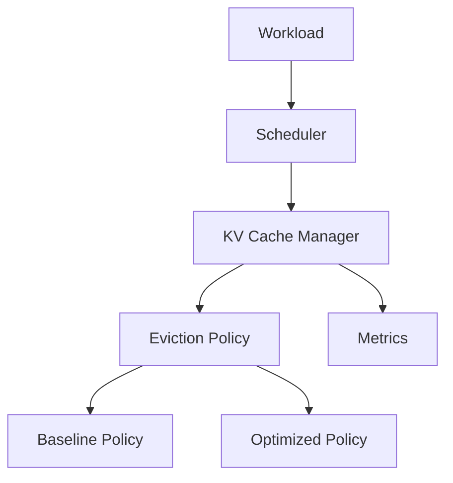

# KV Cache Management Optimization for LLM Inference

## Goal

This course project will reproduce KV-cache management baselines and investigate a new KV-cache optimization policy for LLM inference.

## Current Status

**Phase 0: repository initialization and architecture validation.** No experimental conclusions should be drawn from the simulator.

## Architecture



## Modules

- `scheduler`: request lifecycle and execution selection.
- `kv_cache`: logical block allocation and immutable policy state.
- `policies`: pluggable eviction implementations.
- `workload`: dataset-agnostic request sources.
- `metrics`: runtime events for evaluation extensions.
- `runtime`: deterministic functional simulator only.
- `benchmarks`, `configs`, `docs`, `tests`: future experiment support and project documentation.

## Setup

```bash
python -m venv .venv
pip install -e ".[dev]"
pytest
python scripts/run_demo.py
```

## Team Responsibilities

Member 1 — Architecture, scheduler, integration, project management  
Member 2 — Background, related work, motivation  
Member 3 — Baseline KV cache policy  
Member 4 — Optimization design and implementation  
Member 5 — Dataset, workload and benchmark framework  
Member 6 — Evaluation, visualization, profiling and analysis  
Member 7 — Slides and presentation

## Development Status

`DummyEvictionPolicy` is **not** a baseline and **not** the proposed method. It exists only for smoke testing.
