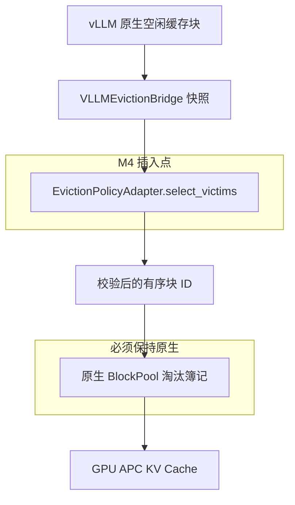

# Phase 2A M4 — 块级 Cost-Aware 设计草案

状态：预设计草案（PRE-DESIGN DRAFT）—— **非授权设计**

## 0. 门禁姿态（请先阅读）

本文档是一份**设计空间收敛与证据承接记录**，既不是已批准的设计，也不是实现授权。

依据 `docs/phase2a-empirical-gap-gate.md`：

```text
只有当 M1 依据经验证据门禁（Empirical Gap Gate）审阅 Method Support Pack 之后，
M4 方可开始方法设计。
只有 GAP-PASS 才应触发常规的方法实现。
```

因此：

| 本文档可以 | 本文档不可以 |
| --- | --- |
| 记录既有证据已经排除掉的设计方向 | 授权任何实现 |
| 说明块级策略需要哪些接口输入 | 向 `EvictionCandidate` 或任何已冻结契约添加字段 |
| 定义能够了结该开放问题的测量 | 冻结评分公式 |
| 给 M1/M6 一个可供评审的 profiling 目标 | 以任何形式（包括默认值）进入运行时成为策略 |

若门禁判定为 `NO-MEASURABLE-GAP` 或 `HEADROOM-BUT-NO-ONLINE-SIGNAL`，本文档将作为**负面结果记录**保留，不据此构建任何方法。

## 1. 来源与验证边界

此处汇总的证据来自一个**未合并**的探索分支：

```text
分支：      origin/feature/cost-aware-forced-unpin-spike
独有提交数：8（2026-09-24 .. 2026-09-26）
合并基点：  e4a24ea（"Mark Phase 1B closed"）
分支末端：  3b8a069
```

该分支**不可合并**进当前 `main`。它创建于 Phase 2A 正式化之前，因此相对 `main` 的 diff 会**删除整个 Phase 2A 基础设施**（`src/kvopt/profiling/`、`src/kvopt/workload/phase2*.py`、`benchmarks/run_phase2a_*`、`configs/phase2/**` 以及各 `phase2a-*` 文档）。它的代码**仅作为参考**承接；该分支上没有任何内容适合直接合并或 rebase。

所承接数字的验证边界：

- 请求级实验运行在一个**确定性离散事件 harness** 上，驱动真实的 `RuntimeCoordinator` + `RetentionManager` + `RetentionRuntimeIntegration` 组件（CONTROLLED 模式）；
- **未涉及任何 vLLM 进程**；
- 成本值使用的是规范 profile 代理值（`PrefillReload(256) = 0.0887301250040764 s`，线性插值），并非实测 GPU 延迟。

依据 `docs/phase2a-profiling-data-contract.md`，这些属于**逻辑释放 / 代理（logical-release / proxy）**观测。它们可以支撑 `HETEROGENEITY-PROVISIONAL` 级别的推理，但**不能**支撑重计算或 serving 层面的结论。

## 2. 承接的既有发现

### 2.1 请求级结果（做了什么，以及为何它已了结该问题）

请求级排序的实现方式是仅覆写 `RetentionAwareSelectionCoordinator` 中已冻结的 `_release_sort_key`：

$$
\text{Score}(r) = \frac{P_{\text{return}}(r) \cdot \left(C_{\text{recompute}}(r) + \lambda \cdot C_{\text{queue}}(r)\right)}{\text{Memory}(r)}
$$

其中 $P_{\text{return}}$ 复用冻结 TTL 估计器所选用的同一套 duration 历史，$C_{\text{recompute}}$ 取自 `ttl_input.prefill_reload_seconds`，$C_{\text{queue}}$ 取自 `ttl_input.queue_delay_t_seconds`，$\text{Memory}$ 取自 `len(entry.block_ids)`。

| 发现 | 结论 | 对设计的后果 |
| --- | --- | --- |
| F.1 | 在 $C(r)$ 线性时，比值 $C_{\text{recompute}} / \text{Blocks}$ 对**每个前缀都是同一个常数**，于是评分退化为 $P_{\text{return}}$ 排序，而该排序对基线本来就在排序的剩余 deadline 单调 | 请求级排序在线性成本下是**结构性中立**，不只是「未调优」 |
| F.2 | TTL 层本身就是那个 cost-aware 过滤器：`argmax_T [F(T)(T_q·eta + R) − T]` 在 $R$ 与 tool-gap 尺度不可比时给出 TTL ≈ 0，于是便宜的前缀根本无法进入保护池 | 释放决策只能看到大 $R$ 条目；保护池已被**预先同质化** |
| F.3 | `queue_delay_t_seconds` 是 `QueueDelayHistory.mean_seconds()` —— 一个全局均值，在同一次决策中对所有候选完全相同 | $\lambda \cdot C_{\text{queue}}$ 项无法区分受害者（16 个矩阵格中 $\lambda{=}1$ 与 $\lambda{=}0$ 完全一致） |
| F.6 | 边际块分母 $P \cdot C / \text{newly\_eligible}$ 作为消融被实现后**被否决**：它会拒绝释放共保护条目，且仍需对每个候选重扫队列 | 已否决的改进方向；不要交付 |
| F.7 | 产生分化需要**同时**满足：(i) 非均匀的 per-block loss，(ii) 保护池中至少存在两个成本类别 | 这就是明确陈述的**获胜条件**，也是一个可检验的预测 |
| E.3 | 总块评分的规划速度比冻结排序快约 37 倍，因为冻结排序的 tie-break 会在每次释放迭代中对每个候选重扫整个队列 | 规划开销不是障碍；冻结排序的二次重扫本身就是一个可扩展性发现 |

在三种非线性成本形态下实测的请求级效果（已归一化，使 32k-token 成本等于规范线性值），选取部分单元：

| 单元 | 基线重计算（秒）/ miss | Cost-aware 重计算（秒）/ miss | 差值 |
| --- | --- | --- | --- |
| `mixed_length @ affine-5s` | 139.62 / 15 | 130.03 / 15 | −6.9% |
| `anticorrelated @ affine-5s` | 155.33 / 18 | 138.20 / 15 | −11.0% |
| `heavy_tail_aged @ power-0.5` | 296.30 / 28 | 262.23 / 25 | −11.5% |
| 全部线性对照单元 | — | — | 0（逐位一致） |

**在 16 个矩阵格中观察到零回归。** 获胜机制是按块贪心：牺牲 loss-per-block 较低的大前缀（用更少的释放次数腾出目标量），并保留小前缀 —— 因为其固定启动开销使每一个被缓存块都变得昂贵。

### 2.2 成本曲线的平台预期

Prefill 成本可分解为 $2NP$（线性项）$+ 2N^2dL$（attention 项）$+$ 固定开销，因此 per-token 成本在两端都很高、在中段最平坦。对 Qwen2.5-0.5B（$P \approx 0.5\text{B}$，$d = 896$，$L = 24$），attention 项在约 $N^\ast \approx 23\text{k}$ tokens 处赶上线性项。规范 profile 点（$r = 256$）位于平坦区，通过线性外推**掩盖了这段曲率**。

推论：任何非均匀性（因而任何请求级收益）预计集中在**长上下文池（> 8k tokens）**，中段池保持中立。在合规 Metal 运行时上测量真实的 $C(r)$ 曲线，是这一整条技术路线的**唯一决定性实验**。

## 3. 为何设计必须下沉到块级

该结构性论证不依赖于 spike 的数字。

vLLM APC 的复用要求前缀**从位置 0 开始连续缓存**。因此：

```text
淘汰前导块（LEADING）  -> 破坏连续性 -> 使其后方所有内容失效
淘汰尾部块（TRAILING） -> 缩短已缓存区间 -> 仅损失该后缀
```

所以，淘汰一个块所引发的损失是它在**前缀内位置**的函数，而不只是被淘汰块数量的函数。一个把单个 $C_{\text{recompute}}$ 值乘以单个块计数的请求级评分无法表达这一点——这正是 F.1 与 F.6 从相反方向报告的内容：分子无法区分，而边际分母需要只有块级才具备的位置信息。

这就是 spike 的最终裁定仍将**块级受害者选择保留为主要贡献路径**的原因。

## 4. 候选损失模型（提案供评审，未冻结）

设某受保护前缀按位置顺序拥有块 $1 \dots n$，$B$ 为原生块大小的 token 数，$C(\cdot)$ 为实测的 token 跨度 prefill/reload 成本。

若被淘汰集合是从块 $k$ 开始的连续**尾部**，则返回的后续请求保留一段前导 APC 命中，并重计算 $r = (n - k + 1) \cdot B$ 个 token：

$$
\text{Loss}(k) = P_{\text{return}}\big(\text{prefix}\big) \cdot C\big((n-k+1) \cdot B\big)
$$

将淘汰范围向头部延伸一个块的**边际**损失为

$$
\Delta_k = P_{\text{return}} \cdot \Big[ C\big((n-k+2) \cdot B\big) - C\big((n-k+1) \cdot B\big) \Big]
$$

两条性质直接可得：

1. 若 $C$ 是凸的，或为带固定开销的仿射函数（affine-with-fixed-overhead），则 $\Delta_k$ 随 $k$ 减小（向头部靠近）而**递增**。此时在单个前缀内，贪心「先淘汰尾部」就是最优的，而且它恰好就是边际损失递增的顺序。
2. 若 $C$ 为**严格线性且无开销**（$C(r) = \beta r$），则对每个 $k$ 都有 $\Delta_k = \beta B$ —— 所有块等价，模型在该前缀上退化为原生 LRU。这在块级复现了 F.1，并精确说明了线性 profile 单元为何必然是中立的。

仿射情形 $C(r) = a + \beta r$ 是拥有非平凡答案的最小模型：尾部块的成本是 $\beta B$，但那个会破坏前导连续段的块还需额外承担固定开销 $a$。

本模型作为**评审对象**提出，而非已决定的公式。权重、归一化、跨条目比较以及回退排序均仍待定。

## 5. 设计选项

以下每个选项都必须保持为纯粹的 `EvictionPolicyAdapter` 实现：它只返回受害者块 ID，不向 vLLM 状态写入任何计算结果，也不触碰原生簿记。

| 编号 | 选项 | 信号输入 | 需要的接口能力 | 预期行为 | 主要风险 |
| --- | --- | --- | --- | --- | --- |
| B0 | 原生 LRU 回退层 | `lru_rank` | 无 | 保持不变；必须始终是默认策略与安全回退 | 无（强制基线） |
| B1 | **部分前缀保留（Partial-prefix retention）** —— 在破坏前导连续段之前，先淘汰受保护前缀的尾部块 | 前缀内位置索引、$P_{\text{return}}$、$C(\cdot)$ | block → owner 映射；位置索引；逐条目的 $P_{\text{return}}$ 与 prefill 成本 | 唯一能产生 §4 所述位置化损失结构的选项 | 需要的接口扩展最大；返回的请求只会得到部分命中，因此「已释放」与「已重计算」的差异会进一步拉大 |
| B2 | 复用概率 × 前缀偏移价值 | 逐条目的 `P_return` 与偏移；前导块继承完整概率，后缀块使用折减后的概率 | owner 映射；位置索引 | 在没有显式成本曲线时近似 B1 | 依赖 $P_{\text{return}}$ 的质量，而其来自 TTL 过滤器已经坍缩过的同一历史层级（见 F.2） |
| B3 | 复用距离排序（execution-distance 风格） | 由 pending server-gap 状态估计的逐程序返回时间 | 逐程序的 pending-gap 暴露 | 按预期复用距离而非新近度排序块 | 与冻结 TTL 只是近似处理的信号重叠；作为贡献前需要对照当前 SOTA 做新颖性核查 |
| B4 | 共享块所有权加权 | 多所有者块集合 | block → owners（多个） | 将共拥有块视为高聚合损失的受害者 | 绝不能触碰 `ref_cnt`（freeze §6）；加权完全停留在策略内部 |

约束这些选项的备注：

- **B0 不是可选项。** 当未选择任何 cost-aware 适配器时，回退路径必须保持逐字节一致，这与 Phase 1B 已采用的冻结基线纪律一致。
- **B1 是唯一针对 F.6 所述缺口的选项。** B2 是它成本更低的近似；B3 与 B4 是正交维度，需要各自的新颖性核查。
- 明确**不推荐**：重写 `BlockPool` 的分配簿记（freeze §6），或把请求级 TTL 目标移植到块级（它优化的是保护窗口，而非受害者价值）。

## 6. 接口缺口（M4 → M1 请求）

上述设计选项无法用当前契约表达。`main` 上的 `EvictionCandidate` 目前只暴露四个字段：

```text
block_id, ref_cnt, has_block_hash, lru_rank
```

`EvictionContext` 暴露 `required_blocks`、`free_blocks`、`total_blocks`、`timestamp`。

`docs/policy-adapter-design.md` 列出 request/session 身份映射、复用概率、重计算成本估计、TTL/pin 状态与 policy score 为**有意未冻结**，仅当其采集语义与归属被定义后才可添加。该条件现已成为本设计的约束性前提。

| 所需输入 | 为何需要 | `main` 上的现状 | 归属 |
| --- | --- | --- | --- |
| Block → 逻辑所有者 `(program_id, prefix_id)` | 没有它，块就完全不具备复用语义 | 已存在于 `RetentionManager` 的反向索引；但未暴露给适配器 | M1 |
| 块在其前缀内的位置索引 | §4 的整个模型都依赖 leading-vs-suffix | 不可用 | M1 |
| 逐条目的 $P_{\text{return}}$ | 评分的复用维度 | 在运行时协调器中计算；从适配器不可达 | M1 |
| 逐条目的 prefill 成本（`ttl_input.prefill_reload_seconds`） | 评分的成本维度 | 已存在于 `RetentionEntrySnapshot`；从适配器不可达 | M1 |
| 物理块的稳定内容身份 | `block_id` 是槽位而非持久身份 —— 槽位会被复用 | 部分具备：仅有 `has_block_hash` | M1 |
| 多所有者块集合 | 仅 B4 需要 | 已存在于 `RetentionManager` 的反向索引 | M1 |

对任何此类扩展的已知硬约束：

- 任何 oracle、regret、`future_reused`、`optimal_victim` 或等价的未来衍生标签，都不得进入运行时代码（`phase2a-profiling-data-contract.md` §1）；
- 逻辑释放块、物理淘汰块、以及后被复用的槽位**不可互换**，不得混为一谈；
- 请求级 P1/P2/P3 到块的映射仍然 **NOT ESTABLISHED**，不得宣称。

## 7. 边界合规



- 插入点：`src/kvopt/runtime/vllm/adapter.py`，即当前 `NativeLRUAdapter` 所在之处。
- 保留资格过滤（retention eligibility）仍是一个**独立层次**（基于 `EligibilityPreparation` 的 `RetentionAwareLRUAdapter`）；不得与 cost-aware 策略合并。
- `VLLMEvictionBridge` 的校验原样继承：返回的 ID 必须唯一、必须存在于候选快照中，且必须覆盖 `min(required_blocks, len(candidates))`。
- 原生对 `ref_cnt`、空闲队列链接、APC 哈希、实际分配与元数据清理的所有权不可协商。
- 不得向 `src/kvopt/continuum/**` 添加任何 Cost-Aware 评分或信号；该 package 是冻结基线。

## 8. 本设计冻结前必须成立的条件

直接映射到门禁，便于 M1 直接裁定：

| 门禁项 | 要证明块级设计合理，它必须展示什么 |
| --- | --- |
| 异质性（Heterogeneity） | 至少一个 realized-loss 视角具备可支持的决策内 spread。逻辑/代理证据只能得到 `GAP-PROVISIONAL`；最强结论需要重计算或 serving 视角 |
| 基线 headroom | Continuum 在 ≥ 10% 的有效非平局决策中误选了一个严格更差的候选，且归一化 regret 的置信区间下界 > 0 |
| 决策时信号 | ≥ 1 个可观测特征或预先注册的简单组合，其关联跨 seed 与场景族保持稳定 |
| 决定性附加测量 | 在合规 Metal 运行时上、针对长上下文前缀实测的**真实 $C(r)$ 曲线**。若服务区间是线性的，§4 性质 2 预测中立，则本设计必须如实报告而非围绕其调参 |

因此，决定性的实验**不是策略对比，而是一次 profile 测量**：若 $C(r)$ 在服务区间内是线性的，则任何块级 cost-aware 策略都不可能获胜，而这本身就是可发表的负面结果。

## 9. 开放问题

1. 在真实（平滑）成本曲线下，保护池是否仍是多类别？还是像 `power-1.5` 单元那样被 TTL 过滤坍缩为单一尺寸类？F.2 指出 TTL 过滤器才是真正的同质化器，因此这是风险最高的未知项。
2. 部分 APC 命中的实际行为是否果然如 §4 所假设 —— 保留前导区间、仅重新 prefill 后缀？这是一个后端行为断言，必须验证而非假定。
3. 正确的跨条目聚合方式是什么？§4 只在单个前缀内排序；把一个大型前缀的 3 块后缀与一个完整的小型前缀相互比较是无法定义的。
4. 损失视角的不一致（逻辑释放 vs 物理淘汰）是否会在任何已观测决策中改变胜者？
5. leading/trailing 不对称是否已被相近工作所涵盖？服务生态中的块级优先级接口正在演进，因此在宣称之前需要一次新颖性核查。

## 10. 非目标

- 本文档不添加任何实现、测试、配置或运行时默认值。
- 不是请求级路线的复活：F.1/F.6 已记录为在线性 profile 下了结了该方向。
- 不是调度或保留方案。保留与调度仍属支撑层。
- 不是任何形式的性能宣称。

## 11. 可追溯性

| 章节 | 来源 |
| --- | --- |
| §1, §2.1 | `docs/experiments/costaware-forced-unpin/spike-report.md`，位于 `origin/feature/cost-aware-forced-unpin-spike`（未合并） |
| §2.1 F.1–F.7, E.3 | 同一份 spike 报告的 findings 与执行开销章节 |
| §2.2 | 同一份 spike 报告的文献证据附录 |
| §4, §5 | 本文档依据 §2.1 的 F.1/F.6 加上 APC 连续性语义推导得出 |
| §6 | `docs/policy-adapter-design.md`（未冻结字段清单）、`src/kvopt/runtime/vllm/types.py` |
| §7 | `docs/policy-adapter-design.md`、`docs/baseline-freeze.md` §6 |
| §8 | `docs/phase2a-empirical-gap-gate.md`、`docs/phase2a-m4-method-support-pack.md` |
| §9.2, §9.5 | `docs/phase2a-profiling-data-contract.md`（block_id 不是内容身份） |

已取代/相关文档：`docs/phase2-plan.md`（Phase 2A 假设与退出门禁）。
